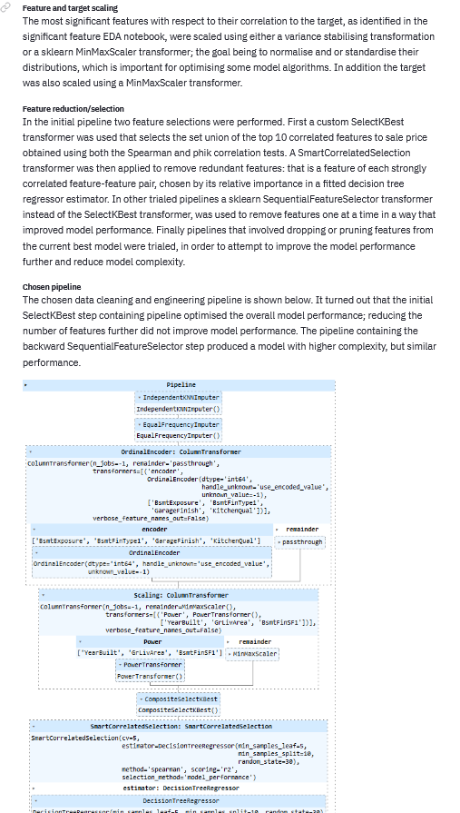

# Heritage Housing Issues

## Project Overview
Heritage housing issues is a Machine learning and data analysis project focused on satisfying a client's business requirements, that are centered on being able to accurately
appraise their inherited properties. A data analysis was performed into the relationship between a house's attributes and its sale price, for houses in Ames, Iowa. A ML regressor model was necessary to predict the sale price of the client's properties and of any other house in the same area. Access to the sale price predictor, as well as
the results of the sale price analysis are presented through a streamlit dashboard app that is live at [https://heritage-housing-issue.herokuapp.com/](https://heritage-housing-issue.herokuapp.com/).

## Dataset Content
* The dataset is sourced from [Kaggle](https://www.kaggle.com/codeinstitute/housing-prices-data). 
* It has almost 1.5 thousand rows and represents housing records from Ames, Iowa, indicating house profile (Floor Area, Basement, Garage, Kitchen, Lot, Porch, Wood Deck, Year Built) and its respective sale price for houses built between 1872 and 2010.

### Dataset metadata
|Variable|Meaning|Values|
|:----|:----|:----|
|1stFlrSF|First Floor square feet|334 - 4692|
|2ndFlrSF|Second-floor square feet|0 - 2065|
|BedroomAbvGr|Bedrooms above grade (does NOT include basement bedrooms)|0 - 8|
|BsmtExposure|Refers to walkout or garden level walls|Gd: Good Exposure; Av: Average Exposure; Mn: Minimum Exposure; No: No Exposure; None: No Basement|
|BsmtFinType1|Rating of basement finished area|GLQ: Good Living Quarters; ALQ: Average Living Quarters; BLQ: Below Average Living Quarters; Rec: Average Rec Room; LwQ: Low Quality; Unf: Unfinished; None: No Basement|
|BsmtFinSF1|Type 1 finished square feet|0 - 5644|
|BsmtUnfSF|Unfinished square feet of basement area|0 - 2336|
|TotalBsmtSF|Total square feet of basement area|0 - 6110|
|GarageArea|Size of garage in square feet|0 - 1418|
|GarageFinish|Interior finish of the garage|Fin: Finished; RFn: Rough Finished; Unf: Unfinished; None: No Garage|
|GarageYrBlt|Year garage was built|1900 - 2010|
|GrLivArea|Above grade (ground) living area square feet|334 - 5642|
|KitchenQual|Kitchen quality|Ex: Excellent; Gd: Good; TA: Typical/Average; Fa: Fair; Po: Poor|
|LotArea| Lot size in square feet|1300 - 215245|
|LotFrontage| Linear feet of street connected to property|21 - 313|
|MasVnrArea|Masonry veneer area in square feet|0 - 1600|
|EnclosedPorchSF|Enclosed porch area in square feet|0 - 286|
|OpenPorchSF|Open porch area in square feet|0 - 547|
|OverallCond|Rates the overall condition of the house|10: Very Excellent; 9: Excellent; 8: Very Good; 7: Good; 6: Above Average; 5: Average; 4: Below Average; 3: Fair; 2: Poor; 1: Very Poor|
|OverallQual|Rates the overall material and finish of the house|10: Very Excellent; 9: Excellent; 8: Very Good; 7: Good; 6: Above Average; 5: Average; 4: Below Average; 3: Fair; 2: Poor; 1: Very Poor|
|WoodDeckSF|Wood deck area in square feet|0 - 736|
|YearBuilt|Original construction date|1872 - 2010|
|YearRemodAdd|Remodel date (same as construction date if no remodelling or additions)|1950 - 2010|
|SalePrice|Sale Price ($)|34900 - 755000|

### Initial observations:
A brief examination of the house attributes, suggests there may well be a large degree of inter-correlation amongst the attributes. What's more is that the attributes may be separable in to clusters or sets based on how strongly they correlate with each other. A set of closely correlated attributes may well be able to be represented by any single attribute within the set, with regard to the sign and magnitude of the correlation with attributes outside the cluster; the same may hold true for the predictive power in relation to an attribute.

### Possible dataset limitations:  
* The dataset for the housing prices lacks any features that represent the location of a house, which may influence the house sale price; for example the proximity to the nearest school or town centre. 
* In addition the dataset lacks any features relating to the time of sale, which may again have a significant impact on the sale price of a house.

In the absence of the above features, the dataset may not be able to sufficiently generate a ML model capable of adequately predicting the sale price of a house in Ames, Iowa;
or at least the model performance may be higher if such features were included in the dataset.

## Business Requirements
The client has received an inheritance from a deceased great-grandfather located in Ames, Iowa. They aim to maximise the sale price for each of their inherited properties.

The client has an excellent understanding of property prices in their own state and residential area, however this knowledge may not generalise, and so might lead to inaccurate appraisals; consequently they seek the help of a data practitioner to assist in accurately valuing their properties. To this end, the client desires to know what makes a house desirable and valuable in Ames, Iowa.

The client has located a public dataset with house prices for Ames, Iowa.

To summarise in precise terms:

* 1 - The client is interested in discovering how the house attributes correlate with the sale price in Ames, Iowa. Therefore, the client expects data visualisations of the correlated variables against the sale price to illustrate any relationships.
* 2 - The client is interested in predicting the house sale price for their four inherited houses, and more generally any other house in Ames, Iowa.

## Hypotheses and their validation

### Hypotheses set 1
Feature Group 1 (Size group - More space, more rooms tends to significantly increase sale price):
* First Floor square feet (1stFlrSF)
* Second Floor square feet (2ndFlrSF)
* Bedrooms above grade (BedroomAbvGr)
* Total square feet of basement area (TotalBsmtSF)
* Above grade (ground) living area square feet (GrLivArea)
* Type 1 finished square feet (BsmtFinSF1)
* Unfinished square feet of basement area (BsmtUnfSF)
* LotArea: Lot size in square feet
* LotFrontage: Linear feet of street connected to property

**Expect a statistically significant strong positive monotonic correlation between these features and the sale price**.

### Hypotheses set 2
Feature Group 2 (Quality group - Higher quality normally means higher sale prices): 
* OverallQual: Rates the overall material and finish of the house
* KitchenQual: Kitchen quality

**Expect a statistically significant moderate positive monotonic correlation between these features and the sale price**.

### Hypotheses set 3
Feature Group 3 (Age/condition group - newer or renovated houses, or houses in better condition tend to have higher sale prices): 
* YearBuilt: original construction date
* YearRemodAdd: Remodel date
* OverallCond: Rates the overall condition of the house

**Expect a statistically significant moderate positive monotonic correlation between these features and the sale price**.

#### Hypotheses set 4
Feature Group 4 (These features are not normally the most significant in determining sale price):
* GarageFinish: Interior finish of the garage
* GarageYrBlt: Year garage was built
* GarageArea: Size of garage in square feet
* EnclosedPorchSF: Enclosed porch area in square feet
* OpenPorchSF: Open porch area in square feet
* MasVnrArea: Masonry veneer area in square feet
* WoodDeckSF: Wood deck area in square feet
* BsmtExposure: Refers to walkout or garden level walls

**Expect a statistically significant weak positive monotonic correlation between these features and the sale price**.

### Validation Methods:
In general all hypotheses will be validated using correlation tests and Predictive Power Scores(PPS) to test whether the relevant features and target have the expected relationships, and whether these relationships are statistically significant. Plots will be used where appropriate to help visualise and also verify any relationships indicated by the tests.

For more information, and to discover the outcomes of the hypotheses, please view the Project Hypothesis page of the dashboard app.

## The rationale to map the business requirements to the Data Visualisations and ML tasks

**Business requirement 1**: discover how house attributes correlate with the 
sale price of houses in Ames, Iowa.

### BR1 User stories
* **As the client, I want** to be able to see how the house attributes relate to the sale price, **so that I can** understand which attributes are most significant for determining the sale price.
* **As the client, I want** to be able to view visual plots, **in order to** better perceive the relationships between house attributes including the sale price.
* **As the client, I want** to be able to access all summary and in-depth annotated information and plots on a dashboard, **so that** it is easily retrievable.
* **As a data practitioner**, I want to be able to view on the dashboard the project hypotheses, as well as how they were validated, **so that I can** come to my own conclusions.

### BR1 User story tasks
* Collect housing data from kaggle.
* Clean data, if necessary, so that it is fit for correlation and PPS analysis.
* Generate a set of correlation matrices with components for all feature-target pairs.
* Generate a Predictive Power Score(PPS) matrix with components for all feature-target pairs.
* Produce a series of plots for all pairs to illustrate any relationships.
* Create project summary dashboard page.
* Create dashboard page displaying the results of the feature-target pairs analysis, with the use of plots.
* Create a dashboard page showing the outcomes of the data analysis project hypotheses.

**Business requirement 2**: predict sale price of houses in Ames, Iowa.

### BR2 User stories
* **As the client, I want** to be able view on a dashboard the predicted sale price of my four properties, **so that I can** maximise the achievable sale price for each of them.
* **As the client, I want** to be able to enter on the dashboard the house attribute values for any property in Ames, Iowa and see the predicted price, **so that I can** see how changing attributes affects the sale price; it also would allow me to update the sale price if I modify one of my properties before selling.
* **As a data practitioner, I want** to be able to evaluate the model performance,
**so that I can**, understand what works well, and how to improve the model.

### BR2 User story tasks
* Select a subset of features that are most correlated to the sale price as determined in BR1.
* Perform exploratory data analysis on these significant features for the purpose of data understanding as part of the CRISP-DM workflow. This will include
feature-feature pair correlation tests, and normality tests for each feature's distribution.
* Perform cleaning/preparation.
* Perform feature engineering/scaling/selection.
* Create data cleaning and engineering pipeline.
* Create modelling and evaluation pipeline.
* Perform model search, and best model selection, for a model to predict sale price from house attributes.
* Optimise the model by performing hyperparameter tuning.
* Evaluate the model performance.
* Finalise the model pipeline once the success criteria are met.
* Calculate prediction intervals for the sale price of the client's inherited properties, using the best model pipelines. 
* Create a dashboard page displaying the attributes and sale prices of the client's four properties.
* Create a dashboard page/section allowing the client to enter a set of house attributes, and calculate the predicted sale price dynamically.
* Create a dashboard page displaying the final model performance and model pipelines. 

## ML Business Case
* To recap, the client wants to be able to predict the sale price of their inherited houses, as well as for any other house in Ames, Iowa, using the attributes contained in a dataset located by the client on kaggle.
* The dataset consists of 1460 housing records from Ames, Iowa, indicating house profile (Floor Area, Basement, Garage, Kitchen, Lot, Porch, Wood Deck, Year Built) and its respective sale price for houses built between 1872 and 2010.
* The attributes consist of categorical and numeric features, and the target (Sale Price) is a continuous variable.
* Therefore a supervised, more specifically a regression, ML model is suitable.
* The model will need to be trained using a subset of the house attributes (the features), and predict the Sale Price target (float) as an output.
* A coefficient of determination $(R^2)$ metric will be used to assess the model performance: how accurately given a subset of the features the sale price can be predicted.
* The success criterion for the model, as agreed with the client, is $R^2 \ge 0.75$.

## Finished model/model pipeline overview
- A random forest regressor model was generated, that achieved a model performance score of $R^2=0.894$ on the test set, and a score of $R^2=0.976$ on the train set.
- The model was selected and tuned using separate grid searches, with 5-fold cross-validation used to assess the mean model performance.
- The JackKnife+ prediction intervals (Targeted coverage 75%) have an estimated coverage of 96%, and an estimated mean interval width of $106954.
- The model train set comprised 75% of the dataset. The random split was chosen based on how representative the train and test sets were to the whole dataset, assessed using
a sample of random splits and significance tests for distribution comparisons.
- In the data cleaning and engineering pipeline, feature selection steps involving a custom sklearn SelectKBest transformer, and a feature engine SmartCorrelatedSelection transformer were employed. Both features and the target were scaled using either a sklearn MinMaxScaler transformer or a variance stabilising transformer. Missing data was imputed using a sklearn KNNImputer (numeric features) or a custom EqualFrequencyImputer (categorical features). Multivariate outlier instances were identified based on the criteria that a designated outlier instance has vector components that are outliers (identified using the IQR method) in at least 50% of the continuous features; the identified outliers were removed from the dataset.

**For more information** see the ML Model dashboard app page, or even look at the various jupyter notebooks, in particular the modelling and evaluation notebook.

## Dashboard Design

### Navigation
Each dashboard app page features a sidebar, that allows navigation between the various app pages via radio inputs.

### Project summary page

Provides an introduction/overview to the project. It features a background section that motivates the project and elaborates the client's background and goals.
It also features a business requirements section, that specifies the clients two core business requirements. Finally it features a dataset overview section,
that gives a brief description of the dataset's content, size and where it can be located. 

### Sale price correlation study page

This page reports the findings of the data analysis performed to discover how the house attributes are correlated to the sale price. It features an overview section that
indicates that many of the attributes have significant correlations to the sale price and to each other. It also discusses the possible limitations of the dataset.

In addition it features a house attributes section, that provides the ability to view a metadata table for the dataset through a checkbox input. The page next features a correlation tests section that through the use of radio inputs allows the reader to select to view heatmaps and tables detailing the Spearman and phi k correlation coefficients, as well as a correlation results summary page. At the end of each subsection there is a takeaway section, that highlights the key points covered.

Finally there is a scatter plots section, that displays all the scatter-type plots for all attribute-sale price pairs. A discussion of the plots is given.

### Sale price predictor page

 

This page first indicates to the user that the model performance satisfies the client's success criteria. It also allows a user via a radio input to select to view the prediction intervals for the sale price of the clients inherited properties; or select to obtain a prediction for another property in Ames, Iowa. The prediction intervals are displayed in a table, and the attributes for the four properties are also visible. To obtain a prediction for another property, the user can use the number/selection inputs to enter values for the required house attributes, before clicking the 'get prediction' button; just above the number inputs, is a section explaining to the user, the range of properties where the model can validly be used to predict the sale price.

### Project Hypothesis page

This page discusses the data analysis hypotheses made regarding the nature of the correlations between the house attributes and the sale price. The page first features overview and hypothesis statement sections that describe the hypotheses made. Then there is a validation methods section that details how the formal and informal parts of each hypothesis were validated. Finally there is an outcomes section that details whether the hypotheses were accepted or true.

### ML Model page

 

 

The page is aimed at data practitioners, looking to discover information regarding the model, and more broadly the model pipelines, used to satisfy the client's business requirements. The page can be broken into three major sections. At the top of the page is an overview section, that restates the purpose of the ML model, as well as the type of model used. Beneath the overview section, is a radio input that allows the user to view either the model performance section, or the model pipelines section.

The pipelines section consists of numerous subsections that convey the methodology behind the attempts to select/optimise both the data cleaning and engineering pipeline, as well as the model pipeline. For the cleaning and engineering pipeline subsection, the trialed feature scaling/selection steps are discussed, as well as the steps involved in the handling of missing data and outliers; a discussion of choosing an optimal dataset split for training and testing is also covered. For the model pipeline subsection, the
process used for selecting the best estimator, as well as for hyperparameter tuning is detailed. In both pipeline subsections, the finalised pipelines are illustrated through
the use of images. A final topic covered in the model pipeline subsection, is the method used to calculate the prediction intervals for the sale price of the inherited properties.

The performance section contains subsections illustrating the model performance in terms of scoring metrics and actual vs prediction scatter plots. It also features
a subsection demonstrating the feature importance of the final best regressor, as well as a subsection detailing the estimated coverage and mean width of the
prediction intervals.

## Deployment
The dashboard app was deployed on [heroku](https://www.heroku.com/).

The live URL link is: [https://heritage-housing-issue.herokuapp.com/](https://heritage-housing-issue.herokuapp.com/)

It was deployed using the following procedure:

1. Log in to your Heroku account, or create an account if required.
2. At the top right of the Heroku dashboard click the "New" button, and from the menu that appears, click the 
'Create new app' button.
3. In the 'Create New App' section that follows, enter a unique name for the app, (indicated by a green tick) in the App name field, and also
select a region, using the 'choose a region drop-down list.
4. Once you have entered a unique app name and selected your region, click the 'create app'
 button.
5. After clicking 'create app' you are then taken to the deploy tab on your apps homepage. From here click on the
'Settings' tab button to view the app settings.
6. On the settings tab scroll down to the 'Config Vars' section, and click the 'Config Vars' button to reveal the configuration
variables for the app.
7. For the case of my app there were no config vars.

8. Having entered the config vars, next scroll back up to the top of the page, and the click back on the 'Deploy' tab button.
9. On this tab, scroll down to the 'Deployment method' section. In this section select 'Github' as
the deployment method.
10. Subsequently log in to your Github account as requested, and select to deploy the main branch of the repository.
11. Finally enable automatic deploys, before clicking to deploy the branch.

## Main Data Analysis and Machine Learning Libraries
* pandas and numpy - involved in essentially all dataset manipulation, storage and display activities, including plots, and calculations.
* feature engine - was used to transform the training and test data as part of feature engineering, mainly by using variance stabilising transformers or feature selection transformers, for example the SmartCorrelatedSelection transformer was used to remove redundant features.
* pandas profiling - used in the sale price study and EDA notebooks to produce profiling reports.
* pingouin, ppscore, phik, scipy - all used in the sale price study and the EDA notebooks to determine relationships between sale price and house attributes, including correlation coefficients. scipy and pingouin also used for the various statistical significance tests used.
* seaborn, matplotlib - used to produce all plots including scatter plots and heatmaps.
* sklearn - used in the tasks needed to create the model/model pipelines, including tasks such as hyperparameter tuning. Also used for the dataset splitting.
* streamlit - used to produce the dashboard app.
* MAPIE - used to calculate the prediction intervals using the JackKnife+ method.

## Technologies used
- python
- streamlit
- Jupyter Notebooks

## Credits

### Code
- In the modelling and evaluation notebook the HyperparameterOptimizationSearch class was taken from code-Institute-Solutions/churnometer (https://github.com/Code-Institute-Solutions/churnometer). The class facilitated conducting and displaying the results of a Grid Search.
- Also in the modelling and evaluation notebook, the model_evaluation, model_evaluation_statistics, and model_evaluation_plots are modified forms of similar functions
found in code-Institute-Solutions/churnometer (https://github.com/Code-Institute-Solutions/churnometer).

### Resources
- https://towardsdatascience.com/how-to-create-a-representative-test-set-f0aa56adaf35
- https://ljvmiranda921.github.io/notebook/2022/08/02/splits/
- https://towardsdatascience.com/how-to-compare-two-or-more-distributions-9b06ee4d30bf
- https://www.analyticsvidhya.com/blog/2020/03/beginners-guide-random-forest-hyperparameter-tuning/
- Barber RF, Candes EJ, Ramdas A, Tibshirani RJ. Predictive inference with the jackknife+.

### Content 
- kaggle house prices dataset.

